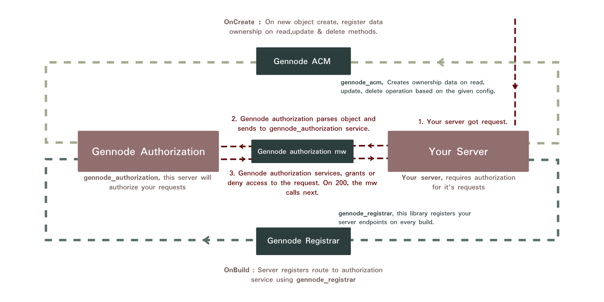

# GenNode Authorization

#### Author
Nathan Mersha

### Installation

Gennode authorization is available on npm, type:

`$ npm i -g gennode_authorization`
and install it globally, now you can use it from the command line.

### Test
`$ npm run test`


**Figure 1** - Gennode authorization description

### Note
This module is accompanied with three additional libraries as described in the above diagram. These modules are :
1. [Gennode ACM](https://www.npmjs.com/package/gennode_acm)
2. [Gennode Authorization_MW](https://www.npmjs.com/package/gennode_authorization_mw)
3. [Gennode Registrar](https://www.npmjs.com/package/gennode_registrar)

### Introduction
Full fledged authorization service. 
1. Register service routes using [this](https://www.npmjs.com/package/gennode_registrar) module.
2. Create a role
3. Create a user
4. Request a token
5. Assign user to the role
6. Give the role access to the routes.
7. By creating acm models give or deny read,delete and update access to the user on a specific model using [this](https://www.npmjs.com/package/gennode_acm) module.
8. Then plugin [this](https://www.npmjs.com/package/gennode_authorization_mw) middleware and your requests will be authorized or not, depending on your configuration.


### Prerequisite
1. An installation of mongodb on the running machine is required for the tests to pass, and for the server to start. Make sure the mongod
server is up and running. Guide on how to install and run MongoDB can be found [here](https://docs.mongodb.com/manual/administration/install-community/ "Installation MongoDB").
2. Make sure to have a version of NodeJS above or equal to Version 4. Get NodeJs [here](https://nodejs.org/en/download/ "Installation NodeJS")
3. Server and model names will be changed to their corresponding camel case format according to [this](https://www.npmjs.com/package/camelcase) module.

### CLI

>RUN `$ gennode-auth --help` for a list of available commands.

> **initialize (init)**
>
> `$ gennode-auth init`
>
> Creates a new genNode configuration file with interactive prompt.
>
> **sample (s)**
>
> `$ gennode-auth s`
>
> Generates a sample gennode_authorization configuration file for a hero academy.

> **generate (gen)**
>
> `$ gennode-auth gen -i <configFilePath> -o <outputPath>`
>
> Initializes a new server by the provided gennode config file.
>
> **options**
>
> *--input, -i* (Required) : Input to the gennode config file path, sample for a config file can be found below or simply run `$ gennode init`
>
> *--output, -o* (Required)    :  Output path where the server files will be generated in.


### Configuration
*The gennode_authorization configuration file is a simple javascript file exporting an object. Default name **gennode_authorization.config.js***

#### Main
> Main configuration field options.

| Option | Description |Default|Type |
|:------------:|:-----------:|:-----------:|:-----------:|
|serviceName            |Name of the service|Sample gen node server|String|
|serviceDescription     |A small description of what your service does|This service is generated by gennode...|String|
|author                 |Service author|Gen Node|String|
|copyright              |Copyright|Copyright : `Current Date`|String|
|repoURL                |Repository url|http://github.com|String|
|licence                |Service Licence|MIT|String|
|version                |Version|0.0.1|String|
|baseURL                |Version|/service|String|
|port                   |Server running port|3400|Number|
|mongodb                |Mongodb url|mongodb://localhost:27017/auth|String|
|reverseProxy           |Reverse proxy address|http://localhost|String|
|collectionReturnSize   |Collection return size|12|String|
|elasticSearchUrl       |Elastic search url|http://localhost:9200|String|
|tokenExpirationTime    |Token expiration time|60d|String|
|logStashPort           |LogStash port|5000|Number|
|docker                 |Tests docker files for the server.|true|Boolean|
|jenkins                |Generates CI pipeline for the server.|true|Boolean|
|postman                |Generates postman collection file|true|Boolean|
|useProxy               |Generate [Nginx](https://www.nginx.com/ "Nginx") configuration file|true|Boolean|
|test                   |Generates stress test and tests the generated api, creates test and coverage report using [Mocha](https://www.npmjs.com/package/mocha "Mocha"), [Chai](https://www.npmjs.com/package/chai "Chai") and [Mochawesome](https://www.npmjs.com/package/mochawesome "Mochawesome")|true|Boolean|
|documentation          |Generates documentation powered by [ApiDoc](https://www.npmjs.com/package/apidoc "ApiDoc")|true|Boolean|
|instance               |App instance (A value of 0 will run the server in cluster mode utilizing all logical cores)|1|Number|
|readMe                 |Generates readme file for the server.|true|Boolean|
|runServer              |Runs server after file generation is completed.|false|Boolean|
|commit                 |Commits the generated file.|true|Boolean|
|commitMessage          |Initial commit message|Initial commit by gennode auth|Boolean|


#### Sample Configuration
> Sample gennode configuration file

```javascript

    /**
     * @author              Nathan Mersha
     * @name                GenNode Authorization
     * @module              index.js
     * @description         Default config file
     * @kind                Config
     * @copyright           June 2019 GenNode Authorization
     */
    
    module.exports = {
        serviceName             : 'GenNode Authorization',
        serviceDescription      : `Generated by genNode_authorization : ${new Date().getFullYear()}. Authorization service`,
        author                  : 'GenNode Authorization',
        copyright               : `Copyright : ${new Date().getFullYear()}`,
        repoURL                 : "http://github.com",
        licence                 : 'MIT', // The MIT License
        version                 : '0.0.1', // First alpha release
        baseURL                 : '/auth',
        environment             : {
            DEBUG                   : "*",
            PORT                    : 3400,
            MONGODB_URL             : "mongodb://localhost:27017/auth",
            REVERSE_PROXY           : "http://localhost",
            COLLECTION_RETURN_SIZE  : "12",
            ELASTIC_SEARCH_URL      : "http://localhost:9200",
            TOKEN_EXPIRATION_TIME   : "60d",
            LOG_STASH_PORT          : 5000,
            SECRET                  : "changeMeNow"
        },
        docker                  : true,
        jenkins                 : true,
        postman                 : true,
        useProxy                : false,
        test                    : true,
        documentation           : true,
        instance                : 1,
        readMe                  : true,
        runServer               : false,
        commit                  : false,
        commitMessage           : 'Initial commit by gennode auth'
    
    };
    
```

### Generated files
> Gennode authorization generated files and directories.

| Name | Description |
|:------------:|:-----------:|
|apidocs                                        |Generated api documentation|
|config                                         |Generated server configuration file|
|controller                                     |Route controller files|
|coverage                                       |Test coverage report|
|dal                                            |Data access layer for models|
|lib                                            |Libraries|
|lib-constant                                   |Error codes and other service related constants.|
|lib-helper                                     |Api requester and controller helper modules|
|lib-helper-api                                 |Api requester libraries, if certificate is provided it will be copied in the cert directory.|
|lib-helper-others                              |Controller helper module|
|lib-middlewares                                |Initializer middleware|
|model                                          |Generated models|
|node_modules                                   |Node modules|
|report                                         |Test report|
|stress.yml                                     |Stress test|
|test                                           |Test suite files (dummy data and url generator module is also located here)|
|.dockerignore                                  |Docker ignore file|
|.env                                           |Environment file|
|.gitignore                                     |Git ignore file|
|apidoc.json                                    |Documentation information|
|app.js                                         |Application start file|
|docker-compose.yml                             |Docker compose file|
|Dockerfile                                     |Docker file|
|gen_node_authorization.postman_collection.json |Postman request collections|
|Jenkinsfile                                    |Jenkins pipeline file|
|package.json                                   |Package file|
|package-lock.json                              |Package lock file|
|README.md                                      |Readme file with basic info|

### Contributing
**If you have anything in mind, that you think is would be awesome to include in the generated server files, feel free to create an issue [here](https://github.com/nathan-mersha/gennode_authorization.git), or fork the project.**
